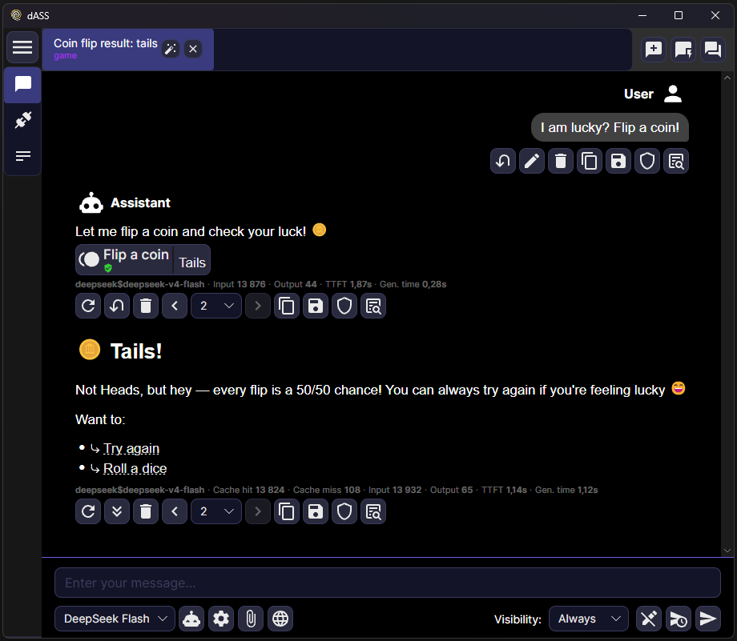
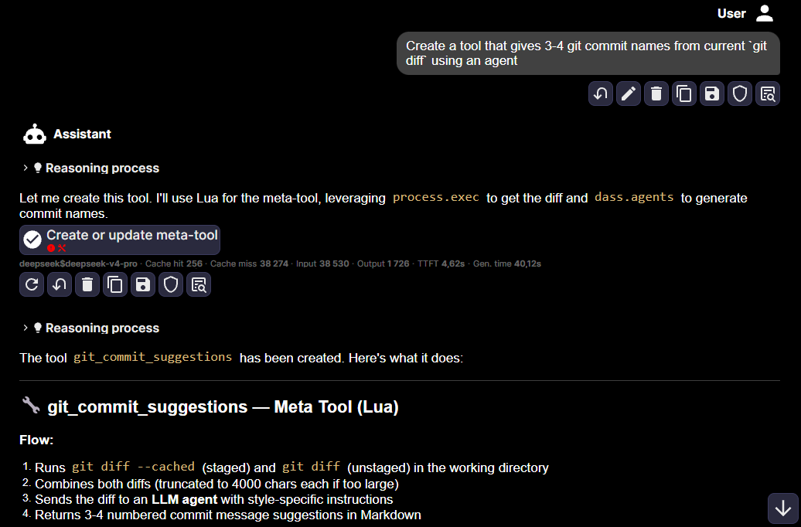
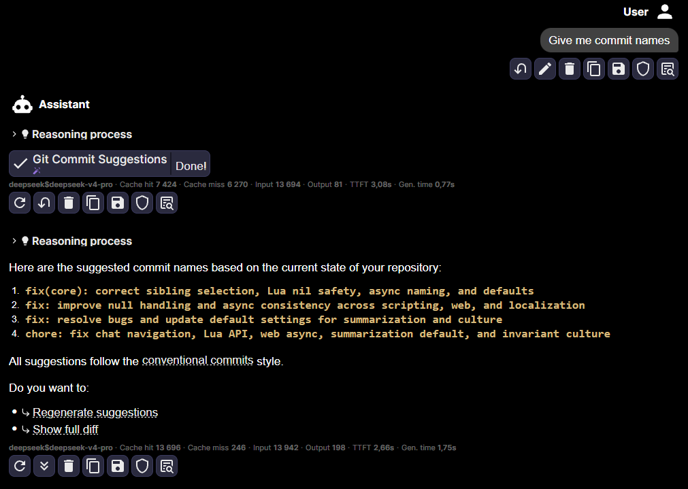
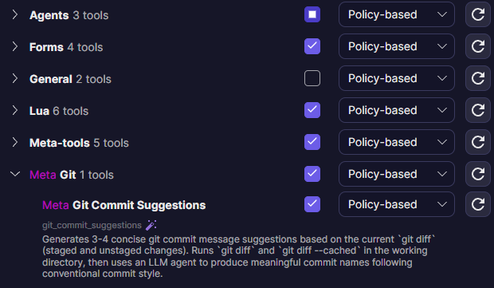

# 🌌 dASS - Desktop Assistant

**dASS (Desktop Assistant)** is a powerful, multi-platform application built with **Avalonia UI** and **.NET 10** that provides an intelligent LLM-powered assistant with a rich and extensible set of tools, multi-agent collaboration, MCP (Model Context Protocol) support, and a web-based chat UI for multi-user chatting.

---

## ✨ Features

### 🧠 Multi-agent system
- **Multiple specialized agents** with individual configurations
- **Agent execution strategies**: Sequential, Random, Adaptive, Mention-only, and Round-robin
- **Agent read permissions** - control what each agent can see in the conversation

### 🛠️ Rich tool system
- **Filesystem operations** - read, write, search, replace, copy, delete files and directories
- **Web requests & search** - fetch URLs, search the web, download files
- **Document reading** - PDF, DOCX, PPTX
- **Image description** - describe images using vision models when main agent cannot read images natively
- **Mathematics** - execute mathematical calculations using built-in evaluator and solver
- **Random** - dice rolls (for DnD), random numbers, GUIDs, list shuffling
- **Human-in-the-Loop** - file pickers, confirmation dialogs, choice selection
- **Shell execution** - with optional live and interactive terminal in the UI
- **Interactive diff confirmation** - preview file changes with color-coded diffs, accept or decline individual edits directly in the chat
- **Time utilities** - get current time, wait/delays
- **Python execution** - Python execution in configured `.venv`/global environment
- **Lua scripting** - scriptable via AsyncLua (async/await Lua interpreter with wide range of API bindings)
- **Meta tools** - dynamic tools that can be created by LLM using Python or Lua when original set of tools is not enough
- **MCP** - tools from external servers

### 🔧 Other features
- Smart **tool behaviour system** that analyses what tools will really do (when file deletion tool will not find the target file, then the tool will not require confirmation, because it will do nothing). This also allows to auto-approve tools that just creates *new* files and require confirmation when tools trying to edit *existing* files
- Built-in **Blazor-based Web UI** that can be hosted on a local endpoint with optional password protection
- **Prompt manager** - edit prompts components, personas, specializations and behaviour sliders via LLT files (located in `%LOCALAPPDATA%/LLMDesktopAssistant/templates`) or via UI (LLT editor will be supported soon)
- Zero-dependency **web-search** using an embedded version of SearXNG - **SearXSharp**, that scrapes multiple search engines (Google, Bing, DuckDuckGo and much more) concurrently. **No API key needed!**

---

## 🪄 Meta tools

When you want expand your agent's functionality, you can give him a task - explore the Lua API and create **meta tool**. In this example, we'd create a tool that gives commit names based on current git context:

We got a tool that executes `git diff` process and puts it to the internal agent with special system prompt, then displays the result to the main agent. Now try it in the another chat:

And check the tool in the agent's settings:

If you want to edit, share or create tools by yourself, go to `%LOCALAPPDATA%/LLMDesktopAssistant/metatools` folder and edit `.lua` and `.py` files.

---

## 🧩 The author's developed tech stack

| Technology | Purpose |
|---|---|
| [**RCLLM**](https://github.com/RomeCore/RCLargeLanguageModels) | Lightweight LLM client library |
| [**LLTSharp**](https://github.com/RomeCore/LLTSharp) | Metadata-rich and easy-readable prompt templates for LLM |
| [**AsyncLua**](https://github.com/RomeCore/AsyncLua) | Extended Lua scripting engine with concurrency and async/await support |
| [**RCParsing**](https://github.com/RomeCore/RCParsing) | Lexerless parser used in various utilities, such as math evaluation tool (also used in LLTSharp and AsyncLua) |
| [**SearXSharp**](https://github.com/RomeCore/SearXSharp) | C#-adapted [SearXNG](https://github.com/searxng/searxng) meta-search engine with 118+ engines supported |
| [**DetectSecretsSharp**](https://github.com/RomeCore/DetectSecretsSharp) | C#-adapted [yelp/detect-secrets](https://github.com/yelp/detect-secrets) used for preventing leakage of secrets when LLM is reading files |

---

## 📜 License

This project is licensed under the **MIT License** — see the [LICENSE](LICENSE) file for details.

Copyright © 2026 **RomeCore**
