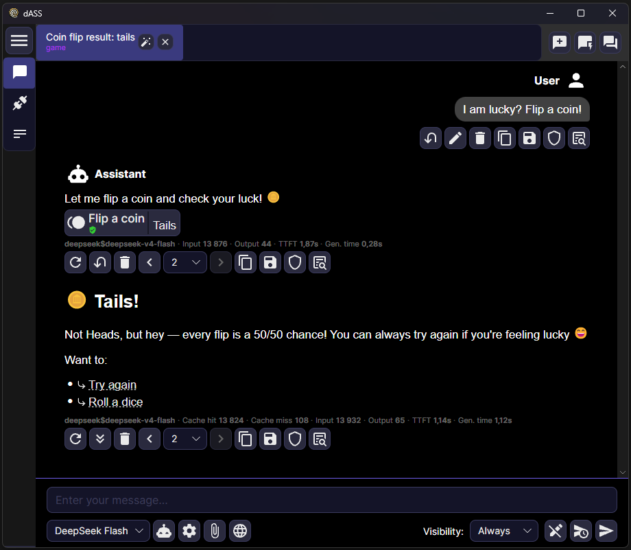
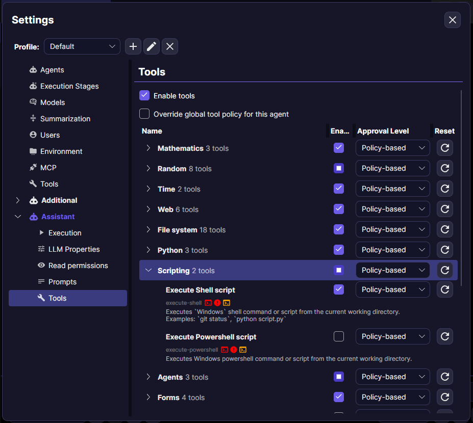
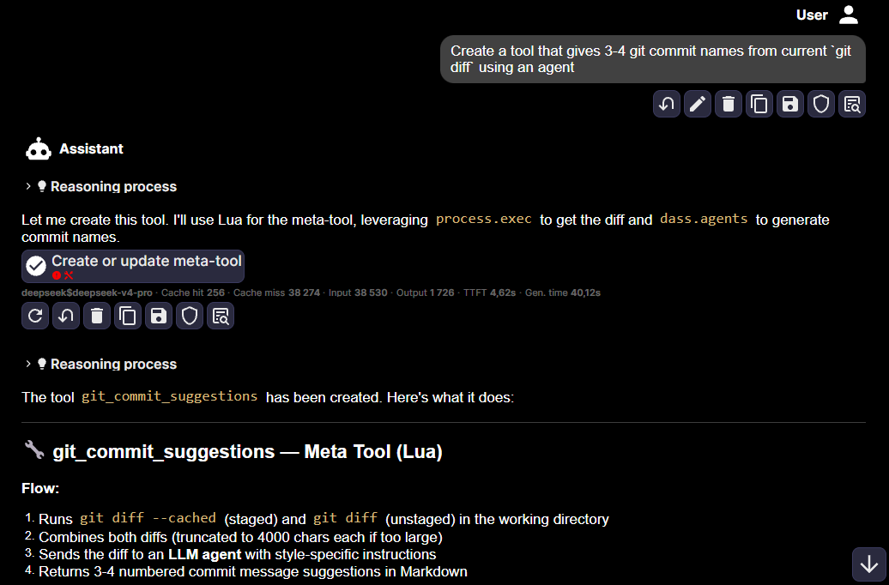
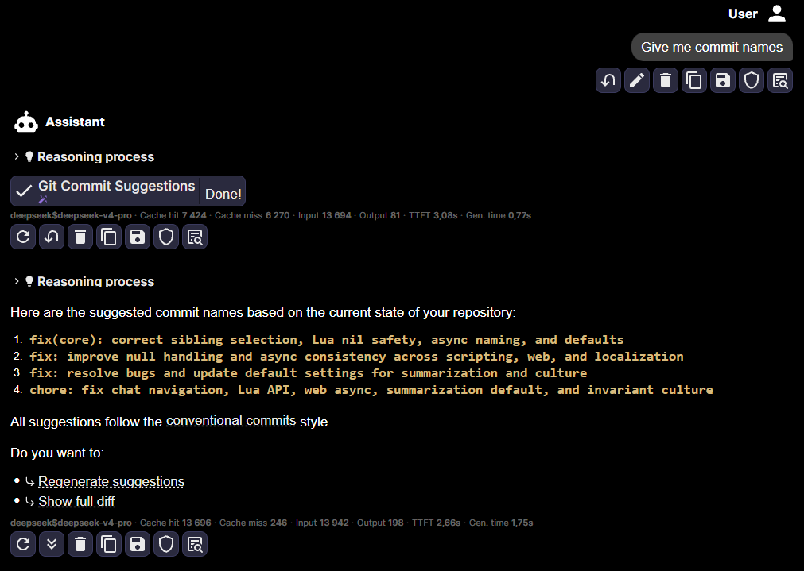
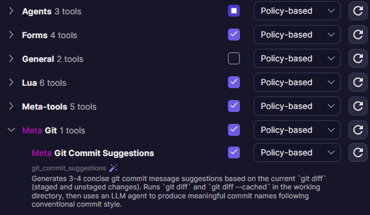

# 🌌 dASS - Desktop Assistant

**dASS (Desktop Assistant)** is a powerful, multi-platform application built with **Avalonia UI** and **.NET 10** that provides an intelligent LLM-powered assistant with a rich and extensible set of tools, multi-agent collaboration, semantic memory, MCP (Model Context Protocol) support, and a web-based chat UI for multi-user chatting.

---

## ✨ Features

### 🧠 Multi-agent system
- **Multiple specialized agents** with individual configurations
- **Agent execution strategies**: Sequential, Random, Adaptive, Mention-only, and Round-robin
- **Agent read permissions** - control what each agent can see in the conversation
- **Per-agent generation settings**: reasoning, persona, specialization, behaviour sliders and skills

### 🛠️ Rich tool system
- **Filesystem operations** - read, write, search, replace, copy, delete files and directories
- **Web requests & search** - fetch URLs, search the web, download files
- **Document reading** - PDF, DOCX, PPTX
- **Image description** - describe images using vision models when main agent cannot read images natively
- **Mathematics** - execute mathematical calculations using built-in evaluator and solver
- **Databases** - query SQLite and PostgreSQL databases via managed connections
- **Random** - dice rolls (for DnD), random numbers, GUIDs, list shuffling
- **Human-in-the-Loop** - file pickers, confirmation dialogs, choice selection
- **Shell execution** - with optional live and interactive terminal in the UI
- **Interactive diff confirmation** - preview file changes with color-coded diffs, accept or decline individual edits directly in the chat
- **Time utilities** - get current time, wait/delays
- **Scripting** - Python execution in configured `.venv`/global environment, Lua via AsyncLua (async/await Lua interpreter with a wide range of API bindings) and C# scripts via Roslyn
- **Skills** - SKILL.md-based capabilities that can be loaded on demand
- **Meta tools** - dynamic tools that can be created by the LLM using Python, Lua or C# when the original set of tools is not enough
- **MCP** - tools from external servers

Configure which tools each agent can use right from the agent settings:

### 🧠 Semantic memory
- **Memory blocks** with configurable access modes (read-only, write, full) attached to chats and agents
- **Facts** with semantic search and **episodic logs** with keyword search
- **Automatic memory recorder and reader** - the assistant remembers important information about you and retrieves it when needed

### 🛡️ Smart tool approval
- **Tool behaviour system** that analyses what tools will really do (when a file deletion tool will not find the target file, then the tool will not require confirmation, because it will do nothing). This also allows to auto-approve tools that just create *new* files and require confirmation when tools try to edit *existing* files
- **Specifier engine** - declarative per-tool policy rules that match tool arguments (including parsed shell commands), with configurable policy aggregation and per-tool overrides
- **Secrets protection** - DetectSecretsSharp prevents leakage of secrets when the LLM reads files

### 🔧 Other features
- Built-in **Blazor-based Web UI** that can be hosted on a local endpoint with optional password protection
- **Multiple working directories** - switch between project roots per chat
- **Prompt manager** - edit prompt components, personas, specializations and behaviour sliders via LLT files (located in `%LOCALAPPDATA%/.llmassist/templates`) or via UI (LLT editor will be supported soon)
- Zero-dependency **web-search** using an embedded version of SearXNG - **SearXSharp**, that scrapes multiple search engines (Google, Bing, DuckDuckGo and much more) concurrently. **No API key needed!**
- **Localization** - full UI localization with semantic keys and `.loc` files (invariant + `ru-RU`)
- **Built-in help viewer** - localized documentation with GitHub-flavoured alerts rendered right in the app
- **Chat summarization** - long conversations are automatically summarized to fit the context window

---

## 🪄 Meta tools

When you want to expand your agent's functionality, you can give him a task - explore the API and create a **meta tool** in Lua, Python or C#. In this example, we'd create a tool that gives commit names based on current git context:

We got a tool that executes `git diff` process and puts it to the internal agent with a special system prompt, then displays the result to the main agent. Now try it in another chat:

And check the tool in the agent's settings:

If you want to edit, share or create tools by yourself, go to `%LOCALAPPDATA%/.llmassist/metatools` folder and edit `.lua`, `.py` and `.csx` files.

---

## 🗺️ Platforms

| Platform | Project |
|---|---|
| Windows / Linux / macOS | `LLMDesktopAssistant.Desktop` |
| Android | `LLMDesktopAssistant.Android` |
| Browser (WebAssembly) | `LLMDesktopAssistant.Browser` |
| Web chat UI (multi-user) | `LLMDesktopAssistant.Blazor` |

## 🧪 Tests

Unit and integration tests covering the core, tools, specifiers, localization, help and more live in `tests/` (`LLMDesktopAssistant.Tests` and `LLMDesktopAssistant.Desktop.Tests`).

---

## 🧩 The author's developed tech stack

| Technology | Purpose |
|---|---|
| [**RCLLM**](https://github.com/RomeCore/RCLargeLanguageModels) | Lightweight LLM client library |
| [**LLTSharp**](https://github.com/RomeCore/LLTSharp) | Metadata-rich and easy-readable prompt templates for LLM |
| [**AsyncLua**](https://github.com/RomeCore/AsyncLua) | Extended Lua scripting engine with concurrency and async/await support |
| [**RCParsing**](https://github.com/RomeCore/RCParsing) | Lexerless parser used in various utilities, such as math evaluation tool (also used in LLTSharp and AsyncLua) |
| [**SearXSharp**](https://github.com/RomeCore/SearXSharp) | C#-adapted [SearXNG](https://github.com/searxng/searxng) meta-search engine with 118+ engines supported |
| [**DetectSecretsSharp**](https://github.com/RomeCore/DetectSecretsSharp) | C#-adapted [yelp/detect-secrets](https://github.com/yelp/detect-secrets) used for preventing leakage of secrets when LLM is reading files |

Built on top of **Avalonia UI 12**, **.NET 10** and a number of great open-source libraries: model providers via RCLLM (OpenAI, DeepSeek, OpenRouter, Novita, Ollama and any OpenAI-compatible endpoint), LiteDB for storage, Markdig for markdown rendering, ModelContextProtocol for MCP, and much more.

---

## 📜 License

This project is licensed under the **MIT License** — see the [LICENSE](LICENSE) file for details.

Copyright © 2026 **RomeCore**
