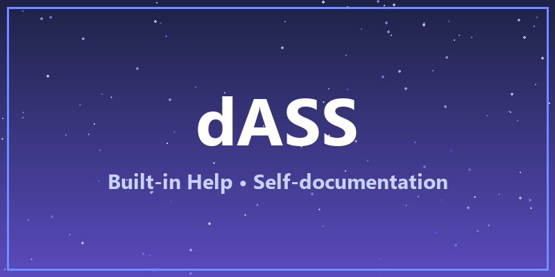

# Getting started

Welcome to **dASS** — a desktop assistant built with Avalonia UI and .NET 10.

## What is dASS?

dASS is a powerful LLM-powered assistant with:

- A rich and extensible **tool system** (filesystem, web, database, scripting and more)
- **Multi-agent collaboration** with specialized agents
- **Semantic memory** for facts and episodic logs
- **Meta tools** — dynamic tools written in Lua, Python or C# script
- A built-in **web chat UI** for multi-user chatting

> [!TIP]
> This help viewer renders GitHub-flavored alerts. Use `> [!NOTE]`, `> [!TIP]`,
> `> [!WARNING]` and `> [!CAUTION]` in your own documentation files.

## First steps

1. Add your **API key** in *Settings → Models*.
2. Create a **new chat** and select a model provider.
3. Ask the assistant anything — it will use tools when needed.

```markdown
# Example markdown

- lists
- **bold** and *italic*
- `inline code`
```

| Feature | Where to read |
|---|---|
| Chatting | [chat](chat.md) |
| Tools | [tools](tools.md) |
| Agents | [chat/agents](chat/agents.md) |


